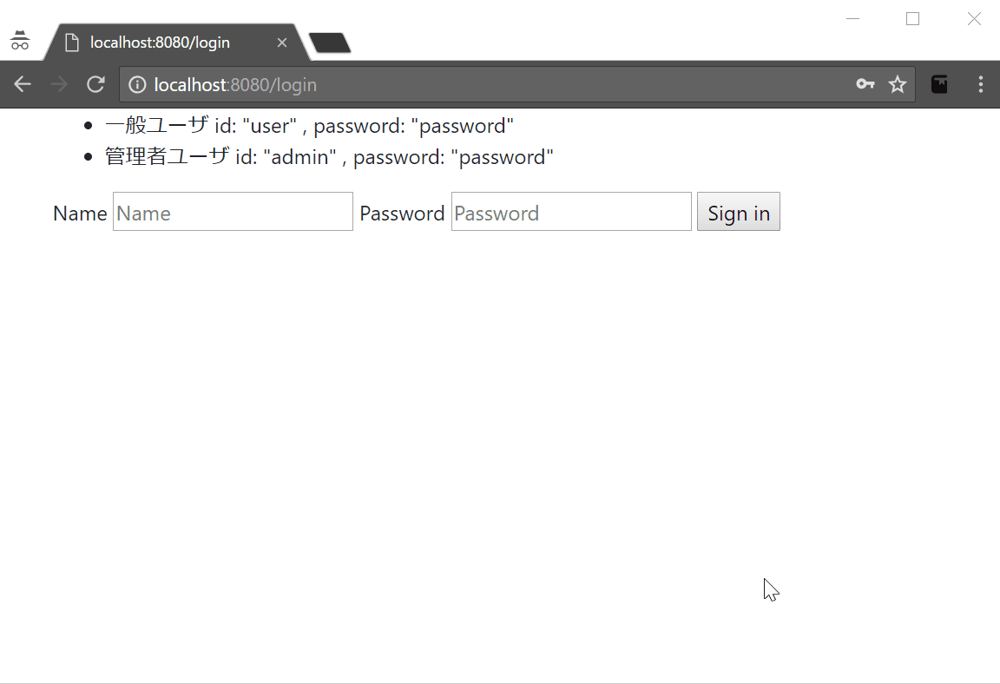

SpringSecurity-with-SpringBoot
------------------------------
SpringSecurityでForm認証。
ロールではなく、権限に基づいたチェックを行う。

アプリの動き
------------
1. localhost:8080/rbac/ にアクセス
2. 初期ユーザでログイン
3. 管理者ならロールにひもづく権限を変更できる
4. 再ログインすると反映される(FiltersecurityInterceptorのalwaysReauthenticateをtrueにすると再ログインなしで反映できそう)

初期ユーザ
----------
一般人(user,password)
管理者(admin,password)

参考
------
* https://spring.io/guides/gs/securing-web/
* http://docs.spring.io/spring-security/site/docs/4.1.0.RELEASE/reference/htmlsingle/#el-common-built-in
* http://wiki.genexus.jp/hwiki.aspx?Role+Based+Access+Control+(RBAC%3A+%E3%83%AD%E3%83%BC%E3%83%AB+%E3%83%99%E3%83%BC%E3%82%B9+%E3%82%A2%E3%82%AF%E3%82%BB%E3%82%B9%E5%88%B6%E5%BE%A1),

起動方法
--------
1. mvn package
2. cd target
3. java -jar springsecurity-with-boot-0.0.1-SNAPSHOT.jar  
